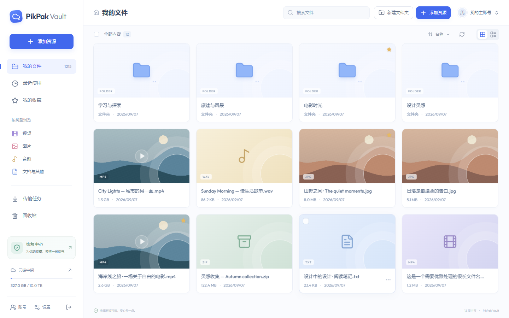

<p align="center"></p>
<h1 align="center">PikPak Vault</h1>
<p align="center"><strong>好内容，值得一直收藏。</strong></p>
<p align="center">给 PikPak 收藏一个自己的家。保存来源，整理目录，在需要时重拾资源。</p>
<p align="center">
  <a href="https://github.com/MengStar-L/PikPakVault/releases/latest"></a>
  
  
  
</p>
<p align="center"><a href="#界面预览">界面预览</a> · <a href="#功能特性">功能特性</a> · <a href="#快速部署">快速部署</a> · <a href="#程序更新">程序更新</a> · <a href="#完整备份与迁移">备份与迁移</a></p>

---

PikPak Vault 是一个独立登录的个人资源库。输入磁链或 PikPak 分享链接后，程序先在本地保存来源，再转存到你的 PikPak 账号。即使远端资源被删除，本地路径、来源、收藏和播放记录仍然保留，方便在原账号或新账号中手动恢复。

## 界面预览



浅色界面、彩色文件图标、流畅的文件夹切换，以及适配手机的导航与工具栏。截图使用模拟资源，不含真实账号资料。

## 功能特性

| | 日常使用 |
| --- | --- |
| 📁 文件资源库 | 网格 / 列表、完整路径面包屑、搜索、分类、收藏、拖动移动、多选、右键菜单和回收站 |
| 🔗 来源留存 | 批量磁链、带提取码分享、分享预览与文件选择；逐文件记录原始来源和相对路径 |
| ☁️ 云端账号 | 保存多个账号、切换活动账号；默认专用目录 `My Pack/PikPakVault`，设置中可自定义 |
| ✨ 即时反馈 | 在当前文件夹创建传输任务，直接显示传输中的文件与进度；持久化任务、断线重连 |
| 🎞️ 预览与播放 | 图片、文本、PDF、音视频；倍速、进度记忆、上游清晰度；可选文件夹视频封面 |
| 🛟 手动恢复 | 扫描缺失、预览恢复范围，依次尝试回收站、哈希秒传与原始来源，重建当前目录 |
| 📦 完整迁移 | 导出 / 导入全部数据库与配套密钥，包括账号认证、分享提取码、收藏、播放记录、任务和日志 |
| 🔄 程序更新 | 检查 GitHub 正式 Release，确认后校验、备份、安装与重启；失败自动回滚 |

> **恢复来源不等于文件备份。** 本程序不在服务器持久化文件内容。原分享失效、磁链不可下载且云端无可用副本时，资源仍可能无法恢复；本地保留路径与失败原因，支持补充新来源。仅管理从本程序存入的资源。

## 快速部署

推荐 Debian 12+ / Ubuntu 24.04+，使用 **systemd** 管理。支持 Linux `amd64`、`arm64`。服务器只需 CA 证书、`curl`、`tar`、`sha256sum`、`useradd`，无需 Go、Node.js 或外部数据库。

从 [Releases](https://github.com/MengStar-L/PikPakVault/releases/latest) 下载对应架构安装包与 `SHA256SUMS`，也可以执行：

```bash
version=0.2.1
case "$(uname -m)" in
  x86_64) arch=amd64 ;;
  aarch64|arm64) arch=arm64 ;;
  *) echo "暂不支持该架构"; exit 1 ;;
esac
bundle="pikpak-vault-$version-linux-$arch.tar.gz"
base="https://github.com/MengStar-L/PikPakVault/releases/download/v$version"
mkdir -p pikpak-vault-install && cd pikpak-vault-install
curl -fLO "$base/$bundle"
curl -fLO "$base/SHA256SUMS"
sha256sum --ignore-missing -c SHA256SUMS
tar -xzf "$bundle"
sudo bash deploy/install.sh
sudo journalctl -u pikpak-vault -n 30 --no-pager
```

访问 **`http://服务器IP:5675`**，使用启动日志中的初始化代码创建管理员密码，或选择「从完整备份导入」。再到「账号」连接 PikPak。

| 安装项 | 默认位置 |
| --- | --- |
| 程序 | `/opt/pikpakvalue/vault` |
| 数据库与密钥 | `/var/lib/pikpak-vault/` |
| 环境配置 | `/etc/pikpak-vault.env` |
| 监听地址 | `0.0.0.0:5675`（systemd 安装） |
| 主服务 | `pikpak-vault.service`，以独立用户 `pikpak-vault` 运行 |
| 更新组件 | `pikpak-vault-update.path` + `pikpak-vault-update.service` |
| 更新记录与备份 | `/var/lib/pikpak-vault-updater/` |

```bash
sudo systemctl status pikpak-vault
sudo systemctl restart pikpak-vault
sudo journalctl -fu pikpak-vault
curl -fsS http://127.0.0.1:5675/healthz
```

公网长期使用可参考 [Caddy 示例](deploy/Caddyfile.example) 配置 HTTPS，将 `VAULT_SECURE_COOKIES=true` 写入环境文件后重启服务。只通过 SSH 隧道访问时，可改为监听 `127.0.0.1:5675`。

## 程序更新

进入 **设置 → 程序更新 → 检查更新**。发现新版本后查看发布说明，点击「安装更新」，再确认安装与重启。**检查更新不会自动安装。**

更新服务独立于主服务运行：下载正式 Release → 校验 SHA-256、包内路径与 ELF 架构 → 停止主服务 → 备份程序和数据库 / 密钥 → 原子替换程序 → 以普通服务用户启动 → 核对版本、进程、更新标记和数据库健康状态。检查失败时恢复旧程序与更新前数据。中断或服务器重启后，会读取更新记录并恢复原版本。

浏览器会自动重连，也可以刷新查看状态。更新备份不会自动删除。

```bash
sudo journalctl -u pikpak-vault-update -n 60 --no-pager
sudo cat /var/lib/pikpak-vault-updater/status.json
# 将版本号替换为实际新版本
sudo bash deploy/update.sh v0.3.0
```

更新源默认是本仓库的公开 Releases，可在 root 管理的环境配置中设置 `VAULT_UPDATE_REPOSITORY=owner/repository`。Windows 和 Docker 支持检查与下载链接；网页自动安装仅用于上述 systemd 安装方式。Docker 更新请重新构建镜像并保留数据卷。

## 完整备份与迁移

**导出：** 设置 → 本地备份 → 下载完整备份。ZIP 包含 `vault.db` 与 `master.key`，覆盖所有账号认证信息、分享提取码、目录、来源清单、各账号映射、收藏、播放记录、管理员密码、设置、任务与操作日志。

**导入现有实例：** 设置 → 导入完整备份 → 校验预览 → 输入当前管理员密码 → 确认替换。程序在本地保留 `before-import-*.zip`，事务失败时当前数据不变。

**初始化导入：** 首次访问选择「从完整备份导入」，输入新实例的初始化代码，再选择备份文件。

导入后，使用**备份中的管理员密码**重新登录。所有浏览器会话失效；未完成任务暂停。核对账号与云端保存位置后，恢复后台检查，并在传输任务页选择需要继续的任务。认证信息会使用目标实例的密钥重新加密。

> 完整备份同时包含加密数据和解密密钥，持有它的人可读取账号认证信息。请私密保存，不要上传至公开仓库。来源 JSON 只供查阅，不包含账号认证或分享提取码，不能替代完整备份。

网页导入上限 512 MiB，数据库解压上限 2 GiB。超过网页上传限制时可用命令行恢复，数据库仍执行相同校验：

```bash
sudo -u pikpak-vault /opt/pikpakvalue/vault backup \
  --data /var/lib/pikpak-vault \
  --archive /var/lib/pikpak-vault/manual-backup.zip

# 只允许恢复到空目录，先停服务并保留原目录
sudo systemctl stop pikpak-vault
sudo mv /var/lib/pikpak-vault /var/lib/pikpak-vault.previous
sudo /opt/pikpakvalue/vault restore \
  --archive /安全位置/pikpak-vault-backup.zip \
  --data /var/lib/pikpak-vault
sudo chown -R pikpak-vault:pikpak-vault /var/lib/pikpak-vault
sudo systemctl start pikpak-vault
```

## 使用与开发

- [详细使用说明](docs/USAGE.md)：资源来源、恢复规则、媒体代理、路径修正与故障排查。
- [接口与状态模型](docs/API.md)：会话、CSRF、任务、导入和更新接口。
- [验证记录与边界](docs/VALIDATION.md)：自动化验证及待实测项目。
- [第三方说明](THIRD_PARTY.md)：公开接口参考与依赖。

```bash
npm ci --prefix web
npm run build --prefix web
go test ./...
go run ./cmd/vault serve --data ./data --listen 127.0.0.1:5675

# Linux 双架构发布包
bash scripts/build.sh 0.2.1
```

前端 React 19 + TypeScript + Vite + Tailwind / Radix / Motion，后端 Go `net/http` + SQLite。前端产物嵌入可执行文件。开发热更新使用 `npm run dev --prefix web`。Docker 可执行 `docker compose up -d --build`。

本项目与 PikPak 官方无隶属关系。PikPak 非公开接口可能变化；验证码、容量不足、来源失效等会显示具体原因，恢复和切换账号均由用户决定。当前不包含本地文件上传、对外分享、在线解压或多用户。
